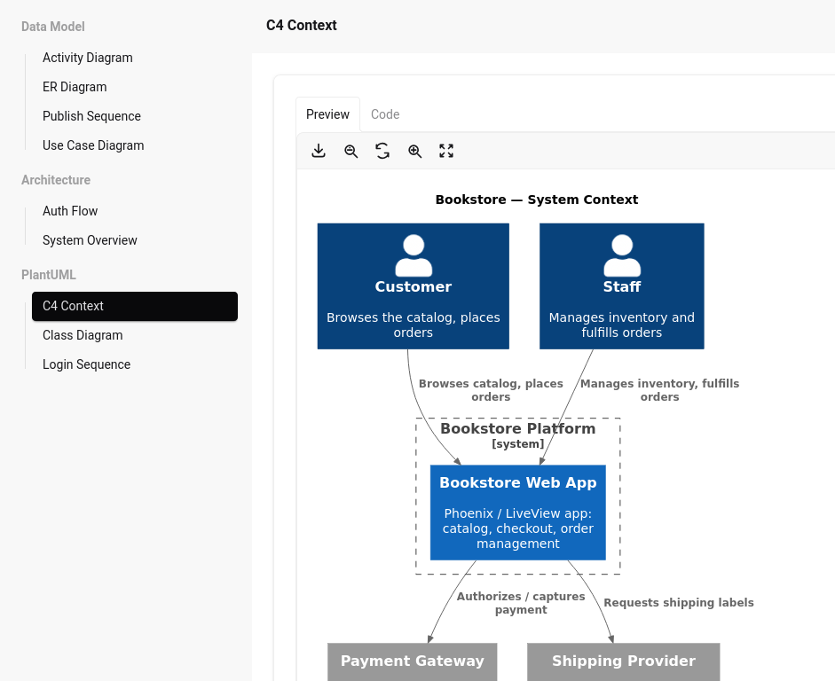

# PhoenixDiagrams

My diagrams were scattered across stale Confluence pages, Notion docs, and Slack threads — none of them matching what the code actually did. So I started using AI agents to generate diagrams straight from the codebase and deployed them somewhere my non-technical teammates could actually find: right inside the app itself, and version-controlled as part of the development flow (trunk-based/gitflow).

PhoenixDiagrams gives your diagrams a home — a slick, searchable catalog embedded in your Phoenix app. Point it at a folder, and watch your Mermaid and PlantUML diagrams come to life, always reflecting the latest state of the system.



## Why you'll like it

- 🎨 **Mermaid + PlantUML, rendered client-side** — no Java, no PlantUML server, no headaches
- 🔍 **Pan and zoom** into every diagram
- 📋 **Copy source** to clipboard in one click
- 🖼️ **Download** any diagram as an image
- 🔄 **Live reload in dev** — save a diagram file, see it update instantly

## Get started in 60 seconds

```elixir
def deps do
  [
    {:phoenix_diagrams, "~> 0.1.0"}
  ]
end
```

### 1. Mount it

```elixir
defmodule MyAppWeb.Router do
  use MyAppWeb, :router
  import PhoenixDiagrams.Router

  scope "/" do
    pipe_through :browser
    live_phoenix_diagrams "/diagrams", diagrams_path: "priv/diagrams"
  end
end
```

That's it — `PhoenixDiagrams.DiagramLive` is now live at `/diagrams`. (`:diagrams_path` is required — there's no default.)

### 2. Give it something to show

Drop a `.exs` file next to your diagram source, and PhoenixDiagrams takes it from there:

```elixir
# priv/phoenix_diagrams/backend/overview.exs
[
  group: "Backend",
  name: "System Overview",
  source: Path.join(__DIR__, "overview.mmd")
]
```

`source` points to a `.mmd` (Mermaid) or `.puml` (PlantUML) file. Add as many `.exs` files as you want, group them however makes sense, and they'll show up in the sidebar — no build step, no config sync, no fuss.

## Hacking on it

```sh
mix deps.get              # install deps
mix precommit             # format + compile (warnings-as-errors) + credo + test
cd demo && mix phx.server  # kick the tires in a real Phoenix app
```

## How to contribute

Found a bug or have an idea? PRs are welcome. See [CONTRIBUTING.md](CONTRIBUTING.md) for the full rundown on setup, testing, and what we look for in a pull request.
